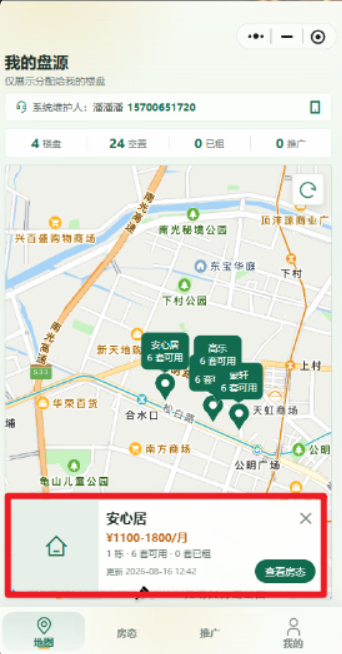
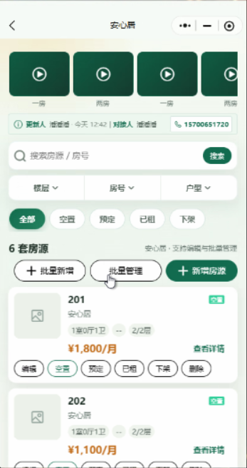
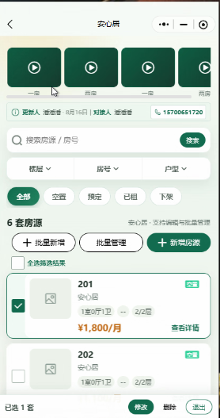
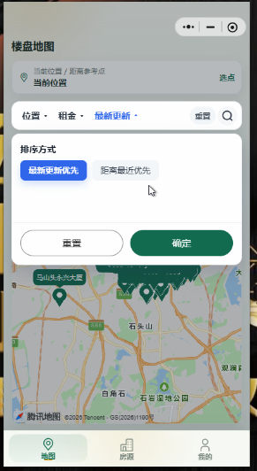
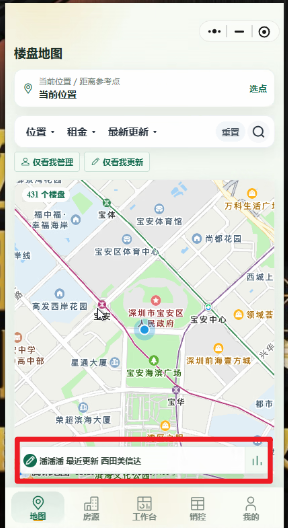
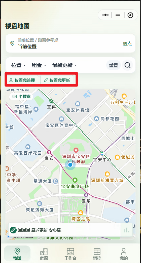

# 深乐租体验版需求会议记录

- 日期：2026-08-17
- 基线：当前体验版（房源/盘源对接人端）
- 状态：会议持续记录中，待产品确认
- 本轮来源：15 条口述需求、12 张界面截图
- 说明：本文用于完整记录产品需求与待确认口径，当前不代表实施方案，不包含代码改动。

## 一、会议核心结论

1. 角色概念需要重新拆分：
   - 盘源对接人回归普通“盘源对接关系”，不再等同房东。
   - 当前“盘源对接人端”改名为“房东端”。
   - 新增“房东端管理”，只有在这里被设置为房东的用户才能进入房东端。
   - 维护人从盘源对接人管理移到房东端管理；普通用户成为维护人后，可进入管理端协助房东管理。
2. “用户端”统一改名为“业务员端”。
3. 房东端需要具备现有管理端的房源设置和批量编辑能力，但不能新增、删除房源。
4. 楼盘和房源需要新增费用、佣金、管理情况、网络情况及特殊推广条件。
5. 地图和列表需要新增楼盘类型、实时盘源、热门盘源、特殊条件、仅看我对接、仅看我维护等筛选。
6. 超级管理员可为已绑定房东的楼盘设置 1—5 级火热等级；业务员端展示并筛选该等级。

> 术语说明：用户口述中同时出现“房源对接人”和“盘源对接人”。本文暂统一使用“盘源对接人”，正式产品名称仍需会上确认。

## 二、术语与入口调整

| 当前名称 | 目标名称 | 说明 |
|---|---|---|
| 用户端 | 业务员端 | 所有用户可见文案同步修改 |
| 盘源对接人端 | 房东端 | 当前体验版能力迁入新的房东身份 |
| 盘源对接人 | 普通盘源对接关系 | 不再代表房东身份 |
| 盘源对接人管理中的维护人管理 | 房东端管理中的维护人管理 | 从原入口移除 |
| 房东端“地图” | 房东端“地图预览” | 只修改房东端，其他端保持原名称 |
| 房东端“房态” | 房东端“楼盘信息” | 只修改房东端，其他端保持原名称 |
| 最近更新 | 实时 | 地图、列表筛选项 |
| 无 | 特殊 | 新增筛选项 |

## 三、角色、关系与权限模型

### 3.1 盘源对接人

- 盘源对接人只是某个楼盘的普通对接关系，不再拥有房东身份。
- 地图、列表增加“仅看我对接”，按当前用户与楼盘的对接关系筛选。
- 盘源对接人管理保留对接人设置能力，移除维护人管理。
- 当前盘源对接人端的业务页面改为房东端后，盘源对接人不再因为“对接人”身份自动进入该端。

### 3.2 房东

- 新增“房东端管理”，功能结构与当前盘源对接人管理基本一致。
- 只有通过房东端管理设置的用户，才可以进入房东端。
- 房东关联自己的楼盘，并通过房东端维护已有房源。
- 房东端允许单套设置和批量编辑，禁止新增、删除房源。
- 楼盘绑定房东后，该楼盘不再保留盘源对接人关系。

### 3.3 维护人

- 维护人归属于房东，可由管理员或普通用户担任。
- 普通用户被设置为维护人后，可以进入管理端。
- 维护人在管理端只能管理其所维护房东名下的楼盘。
- 一个用户可以成为多个房东的维护人，并管理这些房东名下楼盘的合集。
- 房东端管理列表为每个房东增加“联系电话显示”设置：
  - 维护人
  - 房东
- 选择后，业务界面中该房东相关楼盘的联系人和联系电话统一显示对应角色的信息。

### 3.4 超级管理员

- 管理房东身份、楼盘归属、维护人及联系电话显示规则。
- 在管理端地图中，为已绑定房东的实时楼盘设置 1—5 级火热等级。
- 火热等级属于楼盘级数据，业务员端只读展示和筛选。

### 3.5 初步权限矩阵

| 身份 | 可见范围 | 房源编辑 | 批量编辑 | 新增/删除 | 特殊能力 |
|---|---|---:|---:|---:|---|
| 业务员 | 对外可见盘源 | 否 | 否 | 否 | 筛选、查看、导航 |
| 盘源对接人 | 普通盘源 + 自己对接的盘源 | 待确认 | 待确认 | 否 | 仅看我对接 |
| 房东 | 自己名下楼盘 | 是 | 是 | 否 | 房东端、推广条件 |
| 维护人 | 所维护房东名下楼盘合集 | 是，范围待确认 | 是，范围待确认 | 待确认 | 进入受限管理端 |
| 管理员 | 现有管理范围 | 沿用现状 | 沿用现状 | 沿用现状 | 管理业务数据 |
| 超级管理员 | 全部 | 是 | 是 | 是 | 房东管理、热度等级 |

## 四、详细需求

### 需求 01：地图底部楼盘卡片补充费用与佣金

对应图 1。

- 楼盘标题右侧增加小字：
  - 水费：x 元/吨
  - 电费：x 元/度
  - 佣金：x%
- 地图卡片中的佣金只展示该楼盘的最高佣金。
- 月租右侧增加小字：
  - 管理费：x 元/月
  - 网络费：x 元/月，或“自理”
- 网络费支持两种录入方式：
  - 具体金额
  - 自理
- 该卡片只负责展示，不在卡片内编辑。

### 需求 02：只修改房东端底部标签

- 房东端的“地图”改为“地图预览”。
- 房东端的“房态”改为“楼盘信息”。
- 业务员端、管理端及其他端的页面标签保持不变，不得同步改名。

### 需求 03：房东端楼盘信息卡片补充完整费用与佣金

对应图 2。

- 房东端“楼盘信息”页面中的每个楼盘卡片展示：
  - 水费
  - 电费
  - 管理费
  - 网络费
  - 完整佣金信息
- 此处佣金不能只显示最高值，需要完整显示：
  - 半年佣金
  - 一年佣金

### 需求 04：房东端迁入管理端房源设置和批量编辑

参考图 3。

- 将管理端现有房源设置能力完整迁入房东端。
- 将管理端现有房源批量编辑能力完整迁入房东端。
- 房东端只维护已有房源。
- 房东端禁止：
  - 新增房源
  - 删除房源
- 禁止规则需要同时在界面和后端权限层生效，不能只隐藏按钮。

### 需求 05：半年佣金、一年佣金拖动设置

参考图 4。

- 使用带两个拖动点的双向拖动框。
- 分别设置：
  - 半年佣金
  - 一年佣金
- 佣金数值范围：0%—500%。
- 界面需要实时显示两个拖动点对应的佣金值。
- 当前表述中的“最低半年、最高一年”按两个佣金档位理解；两个值是否必须保持半年佣金小于等于一年佣金，待确认。

### 需求 06：房源编辑增加管理情况、网络情况

对应图 5、图 6。

- 放置位置：佣金设置下方、备注上方。
- 管理情况为单选：
  - 可包
  - 不可包
- 网络情况为单选：
  - 可包
  - 不可包
  - 自理
  - 必开
- “网络情况”与楼盘卡片中的“网络费金额/自理”属于两个独立业务字段，实施时不能合并。

### 需求 07：推广页改造为特殊条件推广

#### 7.1 推广首页

- 推广标签页分成两块：
  - 特殊条件推广
  - 首页推广（暂未开通）
- 首页推广当前只展示“暂未开通”状态，不进入本轮功能实现。

#### 7.2 特殊条件推广的楼盘、房源选择

- 进入“特殊条件推广”后，先展示楼盘列表。
- 楼盘卡片的展示内容和房东端“楼盘信息”页面一致。
- 点击楼盘后进入房源列表。
- 房源支持：
  - 单个选择并设置
  - 多选
  - 批量设置推广条件

#### 7.3 可短租

- 字段：是否可短租。
- 选择“是”后显示：
  1. 最低短租月份：输入 1—12 月。
  2. “默认按比例结算佣金”：固定说明文本，不可选择。
  3. 是否可加价。
- “是否可加价”选择“是”后，显示小字：
  - 请电话沟通具体加价规则

#### 7.4 可日租

- 字段：是否可日租。
- 选择“是”后显示：
  1. 佣金条件：输入 1 元以上金额，无固定上限。
  2. 佣金比例：输入 0%—100%。
  3. 日租单价：输入 1 元以上金额，无固定上限。

#### 7.5 可押一付一

- 字段：是否可押一付一。
- 选择“是”后显示两个独立佣金条件：
  - 租期半年：滑动选择 0%—100%。
  - 租期一年：滑动选择 0%—100%。

### 需求 08：用户端改名

- “用户端”统一改为“业务员端”。
- 涉及端切换、标题、菜单、权限提示、登录后去向说明等所有用户可见文案。
- 内部路由名和技术字段是否改名由实施方案决定，优先保持接口兼容。

### 需求 09：所有地图楼盘卡片增加导航按钮

对应图 7。

- 所有角色、所有地图页面的楼盘底部卡片增加“导航”按钮。
- 点击后使用楼盘经纬度打开地图导航。
- 缺少有效经纬度时不发起导航，并给出明确提示。

### 需求 10：媒体长按改名入口迁移

对应图 8。

- 管理端路径：
  - 房源标签
  - 选择楼盘
  - 进入楼栋
  - 进入房源列表
  - 打开房源信息
- 在房源信息顶部媒体横栏中，支持长按媒体修改媒体名称。
- 房源编辑页面中原有的“长按媒体修改名称”能力移除。
- 最终只保留房源信息顶部媒体横栏这一个改名入口。

### 需求 11：盘源对接人、房东、维护人重新建模

- 盘源对接人不再视为房东，只是普通对接人。
- 当前“盘源对接人端”改为“房东端”。
- 新增“房东端管理”，功能与当前盘源对接人管理一致，并作为房东端准入入口。
- 楼盘绑定房东后，清除该楼盘原有盘源对接人关系。
- 盘源对接人管理移除维护人管理。
- 维护人管理迁移到房东端管理。
- 每位房东可配置“联系电话显示”为：
  - 维护人
  - 房东
- 全部楼盘卡片、详情、拨号入口等联系人信息统一按该设置显示。
- 维护人可为管理员或普通用户。
- 普通用户成为维护人后获得管理端入口，但数据权限仅覆盖其维护房东名下楼盘。
- 同一用户可维护多个房东。

### 需求 12：新增楼盘类型“小产权”

- 楼盘类型由两种扩展为三种：
  - 公寓
  - 小区
  - 小产权
- 单个新增楼盘时默认选择“公寓”。
- 批量新增楼盘时默认选择“公寓”。
- 后端枚举、输入校验、输出、导入工具和现有数据兼容需要同步处理。

### 需求 13：地图、列表增加楼盘类型筛选

对应图 9。

- 地图筛选增加“楼盘类型”。
- 列表筛选增加“楼盘类型”。
- 可选值：
  - 公寓
  - 小区
  - 小产权

### 需求 14：实时、热门盘源、特殊条件及地图弹幕

参考图 10、图 11。

#### 14.1 筛选入口

- “最近更新”改为“实时”。
- 新增“特殊”筛选。
- 目标筛选栏至少包含：
  - 位置
  - 租金
  - 实时
  - 特殊

#### 14.2 实时筛选

- 原“最近更新优先”“距离最近优先”改为：
  - 实时更新
  - 热门盘源
- “实时更新”筛选已绑定房东的楼盘。
- 这里的房东指新房东身份，不包含普通盘源对接人。
- “热门盘源”以已绑定房东为前置条件，并要求楼盘火热等级大于 0。

#### 14.3 火热等级

- 只有超级管理员可以设置。
- 设置入口位于管理端地图中的实时楼盘。
- 等级范围：1—5。
- 业务员端以 1—5 个火焰符号展示对应等级。
- 火焰属于产品明确指定的业务等级标识，不作为功能按钮图标使用。

#### 14.4 地图弹幕

- 业务员端地图底部增加更新弹幕：
  - 【楼盘名】于 xx 时间更新
- 业务员端地图上方增加火热招租弹幕：
  - 【楼盘名】正在火热招租，并展示对应数量的火焰
- 弹幕数据必须来自真实楼盘、更新时间和火热等级，不能使用模拟文案。

#### 14.5 特殊筛选

- “特殊”筛选的数据来自“特殊条件推广”。
- 可选条件：
  - 可押一付一
  - 可短租
  - 可日租

#### 14.6 多选与组合

- “实时”内部选项支持多选。
- “特殊”内部选项支持多选。
- “实时”和“特殊”两组条件可以同时生效。
- 同组多选及跨组组合采用“同时满足”还是“满足任一”口径，待确认。

### 需求 15：仅看我对接、仅看我维护

对应图 12。

- 业务员端和管理端都增加或调整为：
  - 仅看我对接
  - 仅看我维护
- “仅看我对接”按当前用户的盘源对接关系筛选。
- “仅看我维护”按当前用户作为维护人的房东关系筛选，结果为这些房东名下的楼盘。
- 两个筛选同时选择时的并集/交集规则待确认。考虑到楼盘绑定房东后会清除盘源对接人关系，采用交集可能长期返回空结果。

## 五、数据模型初稿

以下仅用于识别数据影响，字段名称由实施设计最终确定。

### 5.1 楼盘级

| 数据 | 约束或取值 |
|---|---|
| 水费 | 金额，元/吨 |
| 电费 | 金额，元/度 |
| 管理费 | 金额，元/月 |
| 网络费模式 | 金额 / 自理 |
| 网络费金额 | 网络费模式为金额时填写 |
| 楼盘类型 | 公寓 / 小区 / 小产权，默认公寓 |
| 盘源对接人 | 可空 |
| 房东 | 可空；设置后清除盘源对接人 |
| 实时更新时间 | 用于实时展示和底部更新弹幕 |
| 火热等级 | 0—5；0 表示未标记 |

### 5.2 房源级

| 数据 | 约束或取值 |
|---|---|
| 半年佣金 | 0%—500% |
| 一年佣金 | 0%—500% |
| 管理情况 | 可包 / 不可包 |
| 网络情况 | 可包 / 不可包 / 自理 / 必开 |
| 是否可短租 | 是 / 否 |
| 最低短租月份 | 1—12 |
| 是否可加价 | 是 / 否 |
| 是否可日租 | 是 / 否 |
| 日租佣金条件 | 1 元以上 |
| 日租佣金比例 | 0%—100% |
| 日租单价 | 1 元以上 |
| 是否可押一付一 | 是 / 否 |
| 押一付一半年佣金 | 0%—100% |
| 押一付一一年佣金 | 0%—100% |

### 5.3 房东与维护人关系

| 数据 | 说明 |
|---|---|
| 房东身份 | 决定是否可进入房东端 |
| 房东名下楼盘 | 决定房东端和维护人的数据范围 |
| 房东维护人 | 至少支持一个用户维护多个房东 |
| 联系电话显示 | 维护人 / 房东 |
| 主维护人 | 当一个房东存在多名维护人且选择显示维护人时，可能需要该字段，待确认 |

## 六、关键业务规则

1. 楼盘的房东关系与盘源对接人关系互斥。
2. 房东端只允许维护已有房源，不允许新增、删除。
3. 维护人的管理端权限按所维护房东的数据范围计算，不能获得全局管理权限。
4. 热门盘源必须先满足“已绑定房东”，再满足“火热等级大于 0”。
5. 特殊筛选必须读取房源真实推广条件。
6. 房东端楼盘地图卡片展示最高佣金；房东端楼盘信息卡片展示完整半年、一年佣金。
7. 所有联系人和联系电话显示必须服从房东的“联系电话显示”配置。
8. 批量编辑和批量推广只作用于用户明确选中的房源。

## 七、待会议确认

### 高优先级

1. “盘源对接人”是否为最终正式名称，还是统一使用“房源对接人”。
2. 房东归属究竟按楼盘分配，还是允许按单套房源分配。现有表述出现“房源分配给房东后，楼盘清除对接人”，需要明确数据层级。
3. 一个楼盘能否绑定多个房东；当前按单一房东记录理解。
4. 一个房东能否有多个维护人；选择“联系电话显示=维护人”时具体显示哪一位，需要主维护人或排序规则。
5. 维护人进入管理端后，是否允许新增、删除楼盘、楼栋、房源，还是仅允许编辑和批量编辑。
6. 半年佣金与一年佣金是否独立，是否强制“半年佣金小于等于一年佣金”，拖动步长是否为 1%。
7. “实时更新时间”由什么动作产生：房东手动确认、房源状态变更、任意编辑保存，或系统定时刷新。

### 筛选口径

8. “实时更新”和“热门盘源”同时勾选时，采用交集还是并集。
9. “可押一付一、可短租、可日租”多选时，采用全部满足还是满足任一。
10. “实时”和“特殊”同时启用时，是否按跨组交集处理。
11. “仅看我对接”和“仅看我维护”同时启用时，建议采用并集，需要产品确认。
12. 楼盘类型筛选是单选还是多选。

### 展示与录入

13. 地图卡片“楼盘最高佣金”的统计口径：
    - 楼盘自身设置的最高档佣金；
    - 楼盘全部房源中的最高佣金；
    - 半年佣金和一年佣金两者取较高值。
14. 费用未设置、数值为 0 时，卡片展示“未设置”、0 元，还是隐藏该项。
15. 佣金是否允许小数；水、电、管理、网络费用允许几位小数。
16. 日租“佣金条件”的业务含义和展示单位需要补充。
17. 特殊条件从“是”切回“否”时，已填写的附属字段是保留还是清空。
18. 顶部、底部弹幕的轮播顺序、刷新频率和展示时间。
19. 媒体长按改名覆盖图片和视频，还是只覆盖视频。

## 八、实施依赖顺序建议

1. 先确认角色和数据归属：盘源对接人、房东、维护人、楼盘之间的关系。
2. 再确定费用、佣金、楼盘类型和特殊推广字段。
3. 完成后端权限和查询范围，确保房东端与维护人管理端的数据隔离。
4. 迁移房源单项设置、批量编辑和推广条件设置。
5. 最后完成地图卡片、组合筛选、热度等级和上下弹幕。

## 九、历史设计影响

本次会议需求会覆盖或修正以下历史结论：

- 2026-07-11 的“盘源对接人统一替代房东”术语方案需要废止或重写。
- 当前以房东字段承载盘源对接人的模型需要拆分为“房东身份”和“盘源对接关系”。
- 当前盘源对接人管理中的维护人能力需要迁移到新的房东端管理。
- 当前房东/盘源对接人端允许的新增、删除能力需要按本次“只编辑、不新增、不删除”重新校验。

## 十、会议追加记录

后续口述需求继续追加到本文，并保持：

- 原始编号不丢失；
- 截图与需求一一对应；
- 已确认和待确认分开；
- 角色、权限、字段和筛选口径发生变化时，及时更新前述章节。
