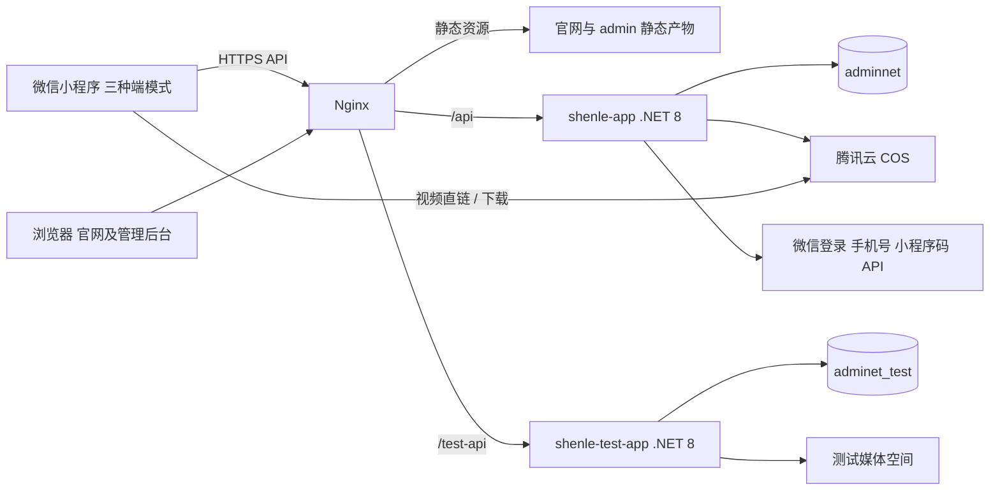
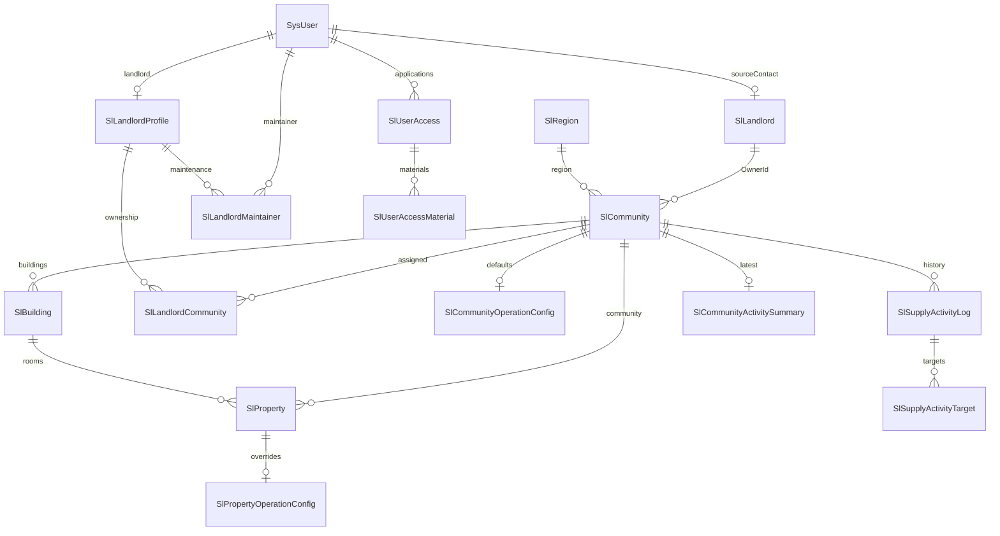

# 01 系统现状与证据

## 1. 调研范围与边界

本次完成了 F/B 的核心调用链审阅、W 的项目入口检查，以及生产服务器只读快照。没有执行压力测试、修改服务器配置、清理日志、创建索引或变更业务数据。

证据等级：

- **运行已确认**：本轮通过 SSH 查询的资源、配置、表结构、索引、摘要及公开接口。
- **代码已确认**：当前工作区明确存在的逻辑，尚未通过真机或测试库逐项复现。
- **待验证风险**：代码路径有风险，但没有生产故障/越权实测证据。
- **建议**：后续设计目标，不表示已完成或已取得收益。

## 2. 整体部署



生产和测试数据库位于同一 MySQL 容器；应用独立容器、目录、配置。测试媒体空间的具体 COS 前缀/桶本轮未核验，不能据此开展上传写入测试。服务器也运行 Redis，但当前两个应用均配置为 Memory 缓存。

| 项目 | 当前情况 |
|---|---|
| 主机 | 腾讯云 Ubuntu，2 核，约 7.45 GiB 内存，约 79 GiB 系统盘 |
| 正式服务 | `https://shenzuyk.com/api/`，`shenle-app`，`/home/ubuntu/shenle` |
| 测试服务 | `https://shenzuyk.com/test-api`，`shenle-test-app`，`/home/ubuntu/shenle-test` |
| MySQL | `mysql:8.0`，正式 `adminnet`，测试 `adminet_test` |
| Redis | `redis:7-alpine`；是否有其他消费者本轮未完整审计 |
| 静态网站 | Nginx 挂载 `/home/ubuntu/shenle/deploy/website`，另有 `/admin/` 路由 |
| Nginx | gzip 已启用，最大请求体 50m，TLS 1.2/1.3 |
| 生产业务 DLL | 本轮前已发布版本，SHA-256 `d8512ff672e3a663e440582cc826671579efa4fea724b26e7156bf3cdb3fabb2`，来自此前部署回读 |
| 小程序 | 本轮上传 0.4.44；公众平台正式版本发布状态仍由用户控制 |

## 3. 仓库与组件范围

| 项目 | 用途 | 本轮定位 |
|---|---|---|
| `ShenLe_SourceContact` | 当前业务后端工作树 | 性能及业务权限主审阅对象 |
| `ShenLe_MiniApp_SourceContact` | 当前小程序工作树 | 当前交付和上传对象 |
| `ShenLe_Web` | Vue 3 + Element Plus 管理后台 | 扫码登录、区域、楼盘、楼栋、房态、批量表单 |
| F/`website` | 静态企业官网 HTML/资源 | 与小程序构建分离 |
| `ShenLe` / `ShenLe_MiniApp_Next` | 原后端/重构主线工作树 | 不自动同步或合并 |
| `ShenLe_MiniApp` | 旧小程序 | 历史业务筛选参照 |
| `ShenLe_MiniApp_Redesign` 等 | 其他工作目录 | 未确认活跃用途，不纳入实施范围 |

现有 README 和 `SOURCE_CONTACT_PORTAL_HANDOFF.md` 仍有旧路径、旧身份和旧导航描述。不能以这些历史说明覆盖当前代码和最近确认的需求。

## 4. 后端结构

### 4.1 技术与分层

- ASP.NET Core 8、Admin.NET/Furion、SqlSugar、Mapster、MySQL。
- `ShenLe.Web.Entry`：启动入口、发布产物和配置装载。
- `ShenLe.Web.Core`：中间件、控制器基础、过滤器、文件写入守卫、路由。
- `ShenLe.Core`：框架基础实体、用户、文件、缓存、日志、任务等。业务优化优先使用配置或适配器，避免直接修改框架。
- `ShenLe.Application`：自有业务服务、实体、DTO、业务权限、媒体处理和活动记录。
- 当前 Application 仍直接引用 Core 以及部分框架插件；**已经有部分解耦接口，但还不是可直接替换框架的纯业务层**。
- Service 通过 `IDynamicApiController` 暴露接口，`ITransient` / `IScoped` 注册依赖；多表写入大量使用 `UnitOfWork`。
- API 返回业务信封；HTTP 200 中也可能包含业务码 401/错误。监控不能只统计 HTTP 状态。

### 4.2 业务模块

| 模块 | 责任 |
|---|---|
| SlWxAuth / SlAccess / SlScanLogin | 微信登录、手机号、资料、业务员申请、Web扫码登录 |
| SlAuthorization | 身份、能力、数据写范围、权限缓存及失效 |
| SlUserManage | 用户列表、审批、昵称、账号等级 |
| SlLandlord | 旧盘源对接人管理，不能按名称误认为新房东身份 |
| SlLandlordManage | 新房东身份、维护人、楼盘归属和联系人显示 |
| SlLandlordEnrollment | 固定房东入驻码、类型2申请、审批 |
| SlLandlordShare | 房东分享筛选码，当前是有时效的分享票据 |
| SlCommunity / SlBuilding / SlProperty | 楼盘、楼栋、房源、筛选、批量及销控数据 |
| SlSourceContactPortal | 新房东端经营服务，也保留另一组兼容路由 |
| SlPublic / SlRegion / SlTag | 脱敏区域、区域边界、标签 |
| SlMedia / SlMediaDraft | 媒体挂载、重命名、草稿和视频封面关系 |
| SlSupplyActivity | 操作日志、具体对象明细、楼盘最新更新摘要与榜单 |

### 4.3 数据关系



图表示逻辑关系，不表示数据库已对全部关系建立外键。媒体使用 `SysFile.BelongId` 的多态关系；视频封面也是 SysFile，`BelongId=视频文件Id`、`FileType=image:video_poster`。直接复制文件行、改变归属或清理草稿时需要检查业务挂载服务。

关键语义：

- `ApplyType=0`：业务员准入；1：旧盘源对接人；2：新房东入驻。
- `SlCommunity.OwnerId`：盘源对接人。新房东归属由 `SlLandlordCommunity` 表达，两者不可混用。
- 楼盘配置提供默认值，房源配置可覆盖；佣金最小/最大值需要在有效房源口径下聚合。
- 状态 0 空置、1 预定、2 已租、3 下架；业务员可租查询目前包含 0/1。房东 Profile 中 AvailableCount 只统计 0，需明确名称和口径，不擅自统一数字。
- 盘源日志记录动作/对象，尚无完整的字段前值/后值及一键恢复机制。

## 5. 身份与权限现状

账号等级与业务身份是两层：666 游客、777 已准入、888 管理员、999 超管；房东、维护人、旧对接人为额外关系身份。

| 身份 | 页面端 | 当前主要业务能力 |
|---|---|---|
| 未登录/游客 | 业务员端预览 | 脱敏区域，受限操作引导登录/申请 |
| 业务员777 | 业务员端 | 可租盘源、筛选、媒体和联系，不写盘源 |
| 房东 | 小程序只允许房东端 | 本人归属楼盘经营及房源修改，无新增/删除 |
| 维护人 | 受限管理端及业务员端 | 受托楼盘修改，无新增/删除/身份管理 |
| 管理员888 | 管理端及业务员端 | 全盘源写入；只删本人创建；管理房东/维护人/区域/标签 |
| 超管999 | 管理端及业务员端 | 全部管理、审批、角色、人员筛选和删除 |
| 旧盘源对接人 | 独立身份本身不授予新管理能力 | 保留对接关系；不等同房东 |

最新小程序对任何已具备房东身份的账号锁定房东模式，包括身份叠加。**后端策略仍按账号等级/身份累加能力，未完整同步为互斥的端权限**。旧客户端和直接调用通用读接口仍需专项验证。

权限缓存：请求内 `SlAuthorizationService._requestAccess`；跨请求 `SlAuthorizationCache` 15分钟 TTL，前缀 `sl_authorization:v3:user:`；底层当前为 Memory。角色和关系修改有主动 Invalidate，但依赖关系、并发读取和分配场景需要逐项测试；不应改成只靠重新登录刷新。

## 6. 小程序结构

- Vue 3 + TypeScript + uni-app/unibest + Pinia + Wot + UnoCSS；微信原生 map。
- 三端复用部分 tab 页面壳；`modeStore` 决定呈现哪套内容，最多5个原生 tab 路径的限制仍存在。
- `src/api/request.ts` 是主要业务 HTTP 层；`src/api/file.ts` 单独管理上传、预览和文件缓存。
- `src/store/auth.ts` 处理会话；`router/interceptor.ts` 和模式判断管理页面进入；微信授权在 `sl-login-consent` 中完成。
- 筛选：楼盘筛选与房源列表筛选是两类组件；后者被房源管理、推广等复用。
- 地图首轮每页200条，循环获取直到全部结果；一次地图使用一个原生 map。
- `entity-change` 已有修订号与变更通知；列表部分场景能就地修补，部分仍逐页重拉全部已加载页。
- `source-contact` 有60秒缓存与同请求合并；定位模块有会话缓存与共享 Promise。
- 文件缓存是进程内 Map；未见容量、会话归属和临时路径失效检查。房东缓存 `clear()` 不会取消在途 Promise，存在旧结果回填风险，需测试。
- 约束声明不等于运行完整：分包优化插件已启用，但实际业务代码如何落包需看构建产物，不能只看配置名。

大型文件（本轮工具统计的是非空行，不能当精确总代码行数）：地图约2357、批量房源约1979、楼盘管理约1671、房东房态约1591。脚本、模板、弹窗、数据编排和样式集中，修改容易交叉影响。

## 7. 媒体与数据更新调用链

```text
选择媒体 -> 微信压缩/准备临时文件 -> 上传视频 -> 上传封面 -> 绑定封面
         -> 加入表单 -> 保存楼盘/房源 -> 挂载媒体 -> 记录活动及更新摘要
```

上传经 `/api/sysFile/uploadFile` 进入应用再写 COS；图片预览回退经 `/api/sysFile/Preview/{id}` 由应用代理流；视频可直接使用 COS URL。代理流 Content-Type 当前为 application/octet-stream。文件类型、访问权限、Content-Disposition、Range 和临时文件路径必须整体设计。

本轮之前实测视频正常播放但无法保存，是缺少 COS downloadFile 合法域名；用户补齐后已确认恢复。不能把平台域名错误误判为编码错误。混合多选近期改动还需真机回归，不能用 mocked tempFiles 测试证明选择器一定完整返回。

## 8. 生产测量快照

采样时段：2026-09-09约19:05–19:13（中国时区）。不含高并发测试，未读取完整日志表。

| 指标 | 结果 | 解释 |
|---|---|---|
| 有效楼盘/楼栋/房源 | 970 / 875 / 19,005 | `IsDelete=0` 精确 COUNT |
| SysFile 行估计/容量 | 23,411 / 10.41 MiB | information_schema 估算 |
| sl_property 总行估计/容量 | 22,186 / 8.50 MiB | 含逻辑删除，估算，不与上行混用 |
| SysLogOp | 205,474 行估计 / 7,735.52 MiB | 数据+索引，约7.55GiB |
| 业务日志/对象明细 | 2.08 / 4.42 MiB | 当前容量；无需因系统日志大就删业务审计 |
| 容器JSON日志 | 生产5,159,552,273字节、测试683,126,023字节 | 文件 stat；全部容器目录约5.6G |
| 主机可用内存 | 5,316 MiB | Linux free 很低主要是缓存，不表示仅剩267MiB可用 |
| Swap | 已用1,658MiB | 3个 vmstat 样本无持续 swap in/out，不能据此判定正在内存抖动 |
| 应用容器内存 | 生产约642MiB、测试约362MiB | 单点工作集；没有显式容器内存上限 |
| CPU | 本次生产约0.04%，MySQL约0.38% | 空闲快照，不代表峰值 |
| 磁盘 | 49%使用，约39GiB剩余 | 当前无需紧急扩盘 |
| 缓存 | 生产Memory/adminnet_；测试Memory/adminet_test_ | 环境前缀不同 |
| 慢查询 | slow_query_log OFF，long_query_time 10s | 缺少适合业务延迟定位的持续慢SQL样本 |

有限最近日志样本：`slCommunity/page` n=116，中位294ms、样本P95约517ms、最大958ms；`slRegion/tree` n=17，中位4ms；`tickers` n=14，中位5ms。样本非均匀时间窗口，不能换算QPS或作为正式SLO。

公开区域接口从服务器经正式HTTPS主动请求3次：132/68/74ms，响应11,920字节、52个区域。只证明此路径当时正常，不代表手机首屏速度。

performance_schema 为累计摘要：封面查询约23,553次，累计检查约3.19亿行；均值约7ms。一次历史 `SELECT * FROM SysLogOp` 达322s，不代表它当前正在运行。需后续做时间窗增量差分而非仅看累计排名。

## 9. 已确认的问题和风险

| 编号 | 证据 | 结论与边界 |
|---|---|---|
| A01 | F/map `loadCommunities`；B/SlCommunity.Page | 地图全量拉取叠加每页全量候选排序，重复计算明确 |
| A02 | B/SysFile索引清单和代表查询EXPLAIN | BelongId/FileType查询没有候选索引，type=ALL，估扫23,412行 |
| A03 | B/SlCommunityBusinessResolver.ResolveAsync | 将候选楼盘下房源取出后再算佣金，不只数据库聚合 |
| A04 | F/property-list `reloadLoadedRangePreservingScroll` | 保位置以逐页重查换取，深列表放大请求 |
| A05 | B/Logging.json、生产日志 | 配置默认全量返回记录；近期日志含 Authorization Bearer，需治理，方案不保存令牌 |
| A06 | 容器 LogConfig json-file/空选项，日志尺寸 | 未见显式单容器轮转上限，需配置核验与治理 |
| A07 | F/auth/router 和 B/SlAuthorizationPolicy、通用查询 | 房东只能进房东端主要是客户端约束；后端通用读接口缺少统一房东所属范围收敛。未做越权实测 |
| A08 | F/source-contact/file cache | 缓存未显式与账号/权限版本绑定，在途旧响应和无上限文件缓存需验证 |
| A09 | B/SlPublic.ResolvePreviewCoordinate | 区域无中心时使用楼盘坐标均值；只有一个点时数学上等于真实坐标，和脱敏目标冲突 |
| A10 | B/SlSupplyActivity | 具备动作审计及更新摘要，但不是字段版本恢复系统 |
| A11 | F/style、mine、各管理页 | 自定义标题/原生标题、卡片、圆角、层级与图标标准混用 |
| A12 | README/交接、package.json/manifest/上传记录 | 项目路径和版本记录有历史残留，发布依赖人工Runbook |

## 10. 证据入口

以下路径用于后续实施定位，不需要再次全仓搜索：

- F：`src/pages/user/map/index.vue` 的 buildQuery/loadCommunities/onShow；`src/pages/admin/property-list/index.vue` 的 reloadLoadedRangePreservingScroll。
- F：`src/api/request.ts`、`src/api/file.ts`、`src/utils/video-save.ts`、`src/utils/location-cache.ts`。
- F：`src/store/auth.ts`、`src/store/mode.ts`、`src/store/source-contact.ts`、`src/store/entity-change.ts`、`src/router/interceptor.ts`。
- F：`src/components/sl-property-filter-bar`、`sl-property-list-filter`、`sl-property-batch`、`source-contact-room-state`、`source-contact-promotion`。
- F：`src/style/index.scss`、`uno.config.ts`、`src/tabbar/config.ts`、`vite.config.ts`、`docs/WECHAT_UPLOAD_RUNBOOK.md`。
- B：`Api/ShenLe.Application/Service/SlCommunity/SlCommunityService.cs` 的 Page/FillPropertyStatsAsync/FillBusinessInfoAsync。
- B：`Service/SlCommunity/SlCommunityBusinessResolver.cs`、`Service/SlPublic/SlPublicService.cs`、`Service/SlSourceContactPortal/SlSourceContactPortalService.cs`。
- B：`Service/SlAuthorization/SlAuthorizationPolicy.cs`、`SlAuthorizationService.cs`、`SlAuthorizationAdapters.cs`。
- B：`Service/SlSupplyActivity/SlSupplyActivityService.cs`、`Service/SlLandlordEnrollment`、`Helper/ImageHelper.cs`。
- B框架只读参考：`Api/ShenLe.Core/Service/File/FileProvider/OSSFileProvider.cs`、`Api/ShenLe.Core/Logging/DatabaseLoggingWriter.cs`、`LoggingSetup.cs`。
- W：`package.json`、`src/router/index.ts`、`src/views/admin`、`src/views/login/ScanLogin.vue`。
